## Arduino入門教學(2) – 準備開發環境 (作者：Copper Maa)

### 取得 Arduino 板子與 USB 傳輸線

首先，你必須先準備一張 Arduino 板子與一條 USB 傳輸線: 
  
要購買 Arduino 板子，可以到國外網站 <http://www.sparkfun.com> 購買，或是到 [Arduino.TW 樂園](http://arduino.tw/)、[藝科資訊商城](http://www.aroboto.com/shop/) 或者是露天拍賣這幾個台灣網站購買。Arduino 的板子有很多種版本，用 [Arduino Uno](http://arduino.cc/en/Main/ArduinoBoardUno), [Arduino Duemilanove](http://arduino.cc/en/Main/ArduinoBoardDuemilanove) 或是 [Diecimila](http://arduino.cc/en/Main/ArduinoBoardDiecimila) 都可以，一張板子大約 30 塊美金左右。 

### 下載 Arduino 開發環境

到 Arduino 官方網站 [arduino.cc](http://arduino.cc/en/Main/Software) 下載軟體。Arduino 軟體不需要安裝，下載後解開壓縮檔即可使用，解壓縮之後，雙擊 arduino.exe 就可以啟動主程式。Arduino 的軟體介面如下： 

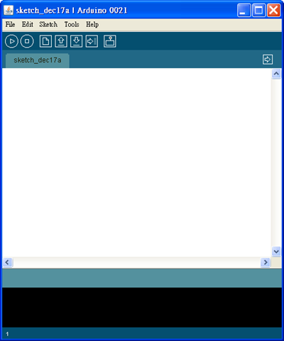

### 連接控制板與安裝驅動程式

Arduino 板子可以透過 USB 供電，不需要另外接電源。將 USB 傳輸線 一端接到電腦，一端接到 Arduino 板子後，會出現 FTDI 驅動程式安裝畫面： 

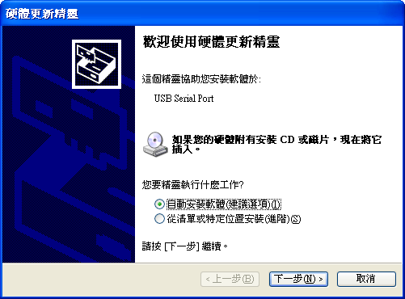

按下「下一步」，接著要指定驅動程式的位置。Arduino 軟體裏已經內附 FTDI 驅動程式，直接把位置指定到 "Arduino-00xx\drivers\FTDI USB Drivers” 後開始進行安裝，例如我用的版本是 Arduino-0021，所以我指定 "C:\arduino-0021-drivers\FTDI USB Drivers”： 

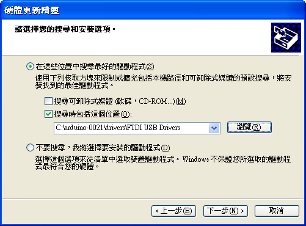

安裝完成的畫面： 

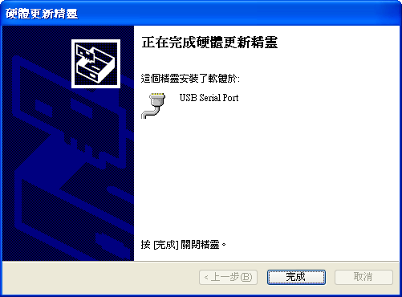
 
打開「裝置管理員」，檢查 Arduino 連接在哪個 COM Port。以我的電腦為例，我的 Arduino 板子接在 COM4： 

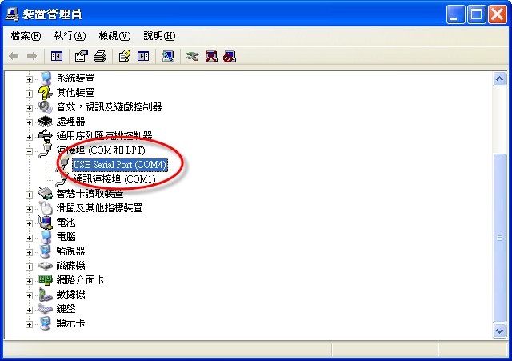

開啟並編譯 blink 範例程式

雙擊 Arduino.exe 啟動 Arduino 主程式，點選 File > Examples > 1.Basics > Blink. 打開 Blink 範例程式： 

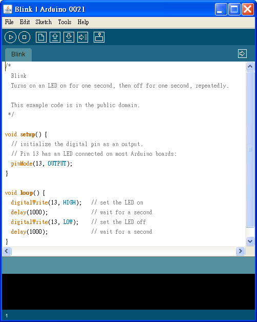

接著按下 Verify  這個按鈕編譯程式，假如程式語法沒有錯誤，畫面下方的狀態列會出現 "Done Compiling.” 的訊息: 

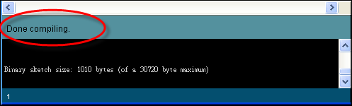
 
### 選擇 Arduino 控制板

點 Tools > Board 選擇跟你所用的 Arduino 對應的板子。我用的是 Arduino Duemilanove，所以我選擇 "Arduino Duemilanove or Nano w/ ATmega328” 這個選項： 

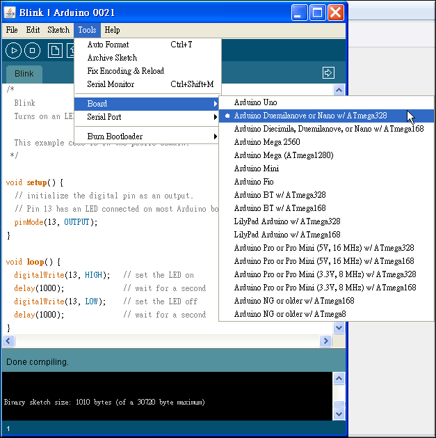

### 選擇 Serial port

點 Tools > Serial Port 選擇 COM Port，以我的電腦為例，我的 Arduino 板子接在 COM4 上，所以我選擇 COM4： 

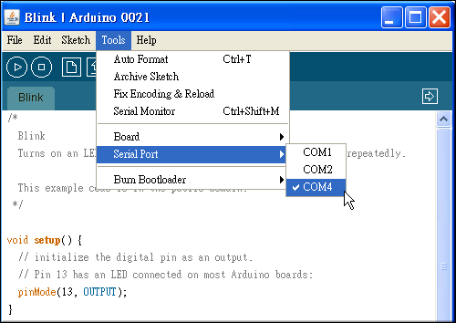

### 上傳程式

最後按下 Upload  這個按鈕，等候幾秒鐘，應該會看到板子上的 RX 和 TX 兩個燈號會快速地閃爍，如果上傳成功，狀態列會出現 "Done uploading.” 的訊息： 

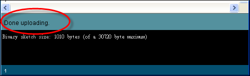

上傳完畢後，經過幾秒鐘後，板子上 pin 13 (L) 的燈號(黃色的燈號)就會開始閃爍，如果是的話，代表你的 Arduino 開發環境已準備好，可以開始學習寫 Arduino 程式了： 

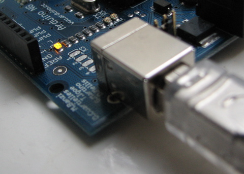

(本文作者為馬萬圳，原為網誌上的文章，經作者授權給程式人雜誌後由陳鍾誠編輯為此文。原文連結：<http://coopermaa2nd.blogspot.tw/2010/12/arduino.html>)
