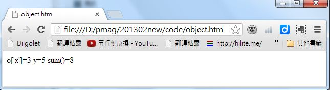
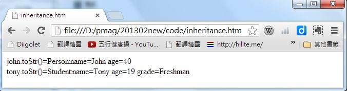
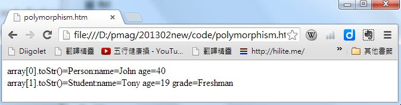
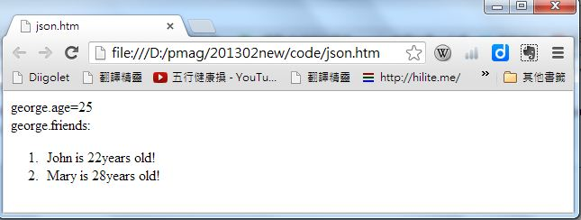

## JavaScript (2) – 以原型為主的物件導向 (作者：陳鍾誠)

雖然說，JavaScript 也能實作很好的物件導向功能，但是如果我們說 JavaScript 是一種物件導向語言，那麼會很容易造成混淆。因為 JavaScript 的物件導向非常非常的特別，與 Java, C++, C# 等語言的物件導向實作方法有很大的不同。

嚴格的說，JavaScript 是一種原型導向語言，原型導向是一種特別簡單的物件導向實作機制，以下是幾個 JavaScript 的物件範例：

```JavaScript
obj = new Object()
obj.x = 3;        // 為 obj 新增一個欄位 x，其值設定為 3
obj.y = 5;        // 為 obj 新增一個欄位 y，其值設定為 5
obj.z = obj.x + obj.y;    // 為 obj 新增一個欄位 z，其值設定為 x+y
```

對於曾經使用像 Java 這種傳統物件導向語言的人而言，會感覺到上述的程式很奇特，因為 obj 一開始只是一個空物件，並沒有包含任何的欄位，但是我們透過指定的方式，動態的為物件增添了 x, y, z 等欄位。

物件導向基本上有三大特性，1.封裝 2. 繼承 3. 多型，瞭解這三個特性的實作方式，通常就可以學會一種語言的物件導向語法了，以下我們將分別針對 JavaScript 中的這三大特性進行介紹。

### JavaScript 物件的封裝

物件導向中的封裝特性，是指將「資料」與「函數」封入一種稱為「物件」的結構當中，以下是 JavaScript 的一個物件範例，其中 x, y 是資料，而 sum 則是函數，這些成員都被封裝在 obj 這樣一個建構函數當中，因此我們呼叫 var o = new obj() 這個指令時，就會建立一個新的物件，並傳回給 o 變數。

程式範例: object.htm

```html
<html>
<body>

<script type="text/javascript">
function obj() {
  this.x = 3;        // 第一種寫法，為 obj 新增一個欄位 x，其值設定為 3
  this["y"] = 5;     // 第二種寫法，為 obj 新增一個欄位 y，其值設定為 5
  this.sum = function() { return this.x + this.y; } // 為 obj 新增一個欄位 add，其值為一個匿名函數
}

var o = new obj();

document.write("o['x']="+o['x']+" y="+o.y+" sum()="+o.sum());
</script>

</body>
</html>
```

執行結果



在 JavaScript 當中，並沒有像 Java 或 C# 這樣的 class 關鍵字，沒有類別這樣的明顯概念，不會外顯的定義出物件的樣板，而是直接在建構函數中建立 this 物件的成員，然後在用 new 建立物件，這種方式很動態也很彈性，但卻不是一般的物件導向製作方式，與 Java 和 C# 有很明顯的差異。

### JavaScript 物件的繼承

物件導向中的繼承特性，是指「子物件」可以繼承「父物件」的資料與函數，並且進行修改，這樣我們就不需要重複的實作父物件已經有的函數，或者定義父物件已經有的資料，以達成程式碼重用的目的。

以下範例中的 Student 物件就繼承了 Person 物件，其方法是在 Student 物件的建構函數中，指定 this.prototype = Person 以達到繼承的目的，然後再呼叫 this.prototype(name, age) 以呼叫父物件的建構函數，建立出 name, age, toStr() 物件內容。

程式範例: inheritance.htm

```html
<html>
<body>

<script type="text/javascript">
function Person(name, age) {
  this.name = name;
  this.age = age;
  this.toStr = function() { 
    return "Person:name="+this.name+" age="+this.age; 
  }
}
var john = new Person("John", 40);

document.write("john.toStr()="+john.toStr()+"<BR/>");

function Student(name, age, grade) {
  this.prototype = Person;
  this.prototype(name, age);
  this.grade = grade;
  this.toStr = function() { 
    return "Student:name="+this.name+" age="+this.age+" grade="+this.grade; 
  }
}

var tony = new Student("Tony", 19, "Freshman");

document.write("tony.toStr()="+tony.toStr()+"<BR/>");
</script>

</body>
</html>
```

執行結果



從上述的範例中您可以看到，JavaScript 的繼承是直接在子物件的建構函數當中呼叫父物件的建構函數所完成的，範例中的 prototype 這個屬性實作了繼承的特性，並且透過 this.prototype(name, age) 這樣的呼叫完成了父物件初始化的動作，這種方式繼動態又彈性，但仍然與 Java, C# 等語言有很大的不同，因此我們稱這種方式為基與原型的物件導向實作方式。

### JavaScript 物件的多型

物件導向中的多型特性，是指當不同的「子物件」繼承同一個「父物件」時，我們可以透過宣告父物件容器，卻將內容指向子物件的方式，以便呼叫到不同子物件中的對應函數。

以下範例中的 var array = [ john, tony ] 這一行，其中的 john 是 Person 類型的物件，tony 是 Student 類型的物件，但是由於 Student 繼承了 Person，而且兩者都有 toStr() 函數，因此當我們用 for (i in array) ... array[i].toStr() ... 這樣的方式呼叫 array[i].toStr() 時，對 john 物件會呼叫到 Person 的 toStr(), 而對 tony 物件會呼叫到 Student 的 toStr(), 這樣就達到了多型的結果。

程式範例: polymorphism.htm

```html
<html>
<body>
 
<script type="text/javascript">
function Person(name, age) {
  this.name = name;
  this.age = age;
  this.toStr = function() { 
    return "Person:name="+this.name+" age="+this.age; 
  }
}
var john = new Person("John", 40);
 
function Student(name, age, grade) {
  this.prototype = Person;
  this.prototype(name, age);
  this.grade = grade;
  this.toStr = function() { 
    return "Student:name="+this.name+" age="+this.age+" grade="+this.grade; 
  }
}
 
var tony = new Student("Tony", 19, "Freshman");
 
var array = [ john, tony ];
 
for (i in array)
  document.write("array["+i+"].toStr()="+array[i].toStr()+"<BR/>");
</script>
 
</body>
</html>
```

執行結果




### JavaScript 物件的精簡表示法 -- JSON 物件資料交換格式

如果我們想直接在程式中宣告一個複雜的物件，可以使用 JavaScript 中的 {...} 與 [...] 的語法組合，用簡單的語法建構出整個物件。這種格式也常被用在網頁程式的資料交換當中，因此有一個很特別的名稱叫 JSON （Javascript Object Notation）。

目前網路上最常使用的資料交換格式是 XML，但是 XML 文件很繁瑣且囉嗦，讓使用者撰寫不方便，而且不容易嵌入網頁中進行處理。為了讓網頁上的共通程式語言 JavaScript 可以輕易的交換資料，網頁程式的設計者也常用 JSON 取代 XML 進行資料交換。

以下是一個採用 JSON 格式的朋友資料範例，該範例中有兩個朋友，一個是 John, 22 歲，另一個是 Mary, 28 歲。

```JavaScript
{
  "friends": [
     {"name": "John", "age": 22 }
     {"name": "Mary", "age": 28 }
  ]
}
```

程式範例：json.htm

```html
<html>
<body>

<script type="text/javascript">

var george = {
  "name": "George",
  "age": 25,
  "friends": [
     {"name": "John", "age": 22 },
     {"name": "Mary", "age": 28 }
  ]
};

document.write("george.age="+george.age+"<br/>");
document.write("george.friends:\n<ol>");
var friends = george.friends;
for (i in friends)
  document.write("<li>"+friends[i].name+" is "+friends[i].age+"years old!</li>");
document.write("</ol>");
</script>
 
</body>
</html>
```

執行結果



### 結語

以上我們簡單的介紹了 JavaScript 的物件導向功能，這種物件導向的實作方式由於是以原型為核心的，因此筆者喜歡稱 JavaScript 為原型導向 (prototype oriented) 的語言，雖然並不是很多人使用「原型導向」這個用法。

在這兩期當中，我們從第一期的 JavaScript 語法基礎開始，到本期的物件導向介紹，大致已經將 JavaScript 的基本語法介紹完畢。在下一期當中，我們將會討論較為進階的 JavaScript 語言特性，像是匿名函數、閉包 (closure)、this 關鍵字的用法等等，我們下期見！

