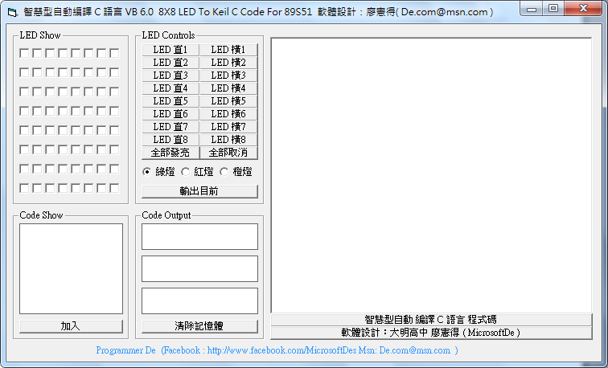
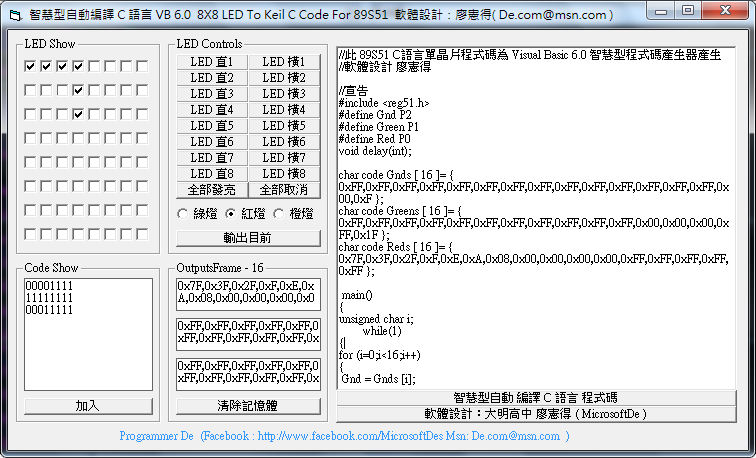
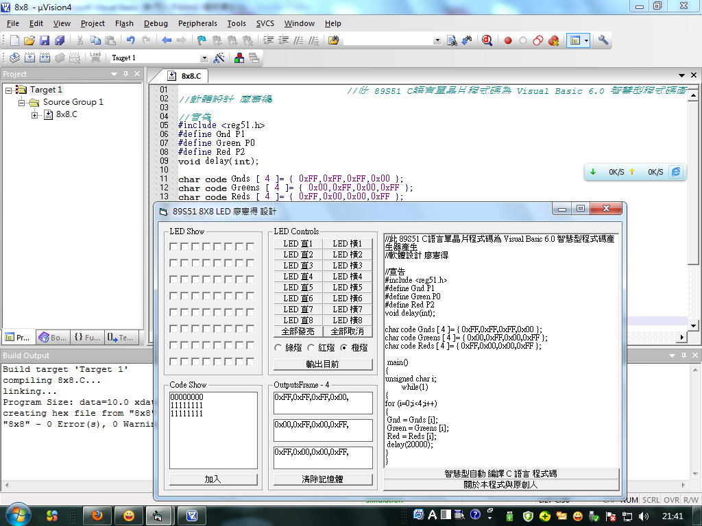

## 智慧型自動編譯 C 語言 VB 6.0  8X8 LED To Keil C Code For 89S51  (作者：廖憲得)

### 軟體介面



### 軟體介紹與設計構想

這是一套由Visual Basic 6.0 設計的軟體，使用來與 89S51、8051 等其他單晶片結合使用的自動轉C語言工具。它的功能可以由使用者輕輕鬆鬆使用滑鼠點一點想要的花樣，並且一鍵自動產生為C語言的程式碼，省得晶片開發設計者需要花費許多計算時間來編譯一套屬於自我花樣的C語言，利用這套軟體只需要動動滑鼠，小小的幾個動作就能夠編譯出C語言的程式碼，甚至它可以搭配Keil C 等其他 89S51、8051 單晶片的編譯軟體。

由於身為高職生的我，因為單晶片C語言89S51設計這門課的專題所需，為了有效率且快速的完成在矩陣式8x8 LED小綠人、小紅人…等等專題上，很多花樣LED燈的閃法、跑法、亮法剛開始都需要以人工的方式慢慢計算在編譯，常常因為一個不小心算錯而導致LED燈的變化不如預期，而使用Visual Basic 6.0 開發了這一套軟體，只需要透過基本的演算法、搭配字串的資料處理，很快的就能夠編寫出這樣的一套軟體。

### 軟體用途與未來趨勢

其實開發這樣的軟體不只是可以運用在8X8 LED 上面，甚至我也撰寫過七段顯示器、蜂鳴器…等等的輔助軟體，相信不只是可以運用在C語言，也可以直接編譯成Java、C# 等等其他程式語言。甚至是運用在其他系統上，利用某個語言來編譯另外一個語言的概念可以衍生出更多讓開發變的更方便更便利的輔助軟體。

未來趨勢當然不只是運用在單晶片、專題上面，甚至可能連手機遊戲、APP，在日後都有相關的輔助設計軟體產生。這種〝為了讓開發變得更便利〞的輔助軟體，在設計上也需要許多字串處理的巧思，只需要透過一些簡易的硬體演算法，像是在什麼情況中給0或給1等等，在設計此類型的輔助軟體就顯得相當容易！

### 使用效果





### 部分程式碼與註解

```VisualBasic
' 以下開始皆為編譯成 C 語言的核心資料字串處理部分
' (KeilC 為輸出的 TextBox 文字方塊)
KeilC = KeilC & "//此 89S51 C語言單晶片程式碼為 Visual Basic 6.0 智慧型程式碼產生器產生" & vbCrLf
KeilC = KeilC & "//軟體設計 廖憲得" & vbCrLf & vbCrLf
KeilC = KeilC & "//宣告" & vbCrLf
KeilC = KeilC & "#include <reg51.h>" & vbCrLf
KeilC = KeilC & "#define OutputP0 P0" & vbCrLf
KeilC = KeilC & "#define OutputP1 P1" & vbCrLf
KeilC = KeilC & "#define OutputP2 P2" & vbCrLf
KeilC = KeilC & "#define OutputP3 P3" & vbCrLf
KeilC = KeilC & "void delay(int);" & vbCrLf & vbCrLf
' OutputsFrame.Tag 為 Visual Basic 中設定的 N 個動作存在 OutputsFrame.Tag 中 利用來當動態陣列數用
' 而 VBOutputs0、VBOutputs1、VBOutputs2、VBOutputs3 則是分別需要輸出的資料 (部分為 16進制 )
KeilC = KeilC & "char code OutTempP0 [ " & OutputsFrame.Tag & " ]= { " & VBOutputs0 & " }; " & vbCrLf
KeilC = KeilC & "char code OutTempP1 [ " & OutputsFrame.Tag & " ]= { " & VBOutputs1 & " }; " & vbCrLf
KeilC = KeilC & "char code OutTempP2 [ " & OutputsFrame.Tag & " ]= { " & VBOutputs2 & " }; " & vbCrLf
KeilC = KeilC & "char code OutTempP3 [ " & OutputsFrame.Tag & " ]= { " & VBOutputs3 & " }; " & vbCrLf

KeilC = KeilC & " main()" & vbCrLf
KeilC = KeilC & "{" & vbCrLf
KeilC = KeilC & "unsigned char i;" & vbCrLf
KeilC = KeilC & "        while(1)" & vbCrLf
KeilC = KeilC & "{" & vbCrLf
KeilC = KeilC & "for (i=0;i<" & OutputsFrame.Tag & ";i++)" & vbCrLf
KeilC = KeilC & "{" & vbCrLf
' OutputP0、OutputP1、OutputP2、OutputP3 為 89S51 單晶片的 PX 輸出變數
' OutTempP0、OutTempP1、OutTempP2、OutTempP3 則為上面自動建立的陣列
' 原理就是把同一系列的一個所有動作自動存放到一個陣列當中，而要呼應這個動作就只需要做以下的呼叫指令。
KeilC = KeilC & " OutputP0 = OutTempP0 [i];" & vbCrLf
KeilC = KeilC & " OutputP1 = OutTempP1 [i];" & vbCrLf
KeilC = KeilC & " OutputP2 = OutTempP2 [i];" & vbCrLf
KeilC = KeilC & " OutputP3 = OutTempP3 [i];" & vbCrLf

' delay 為 C 語言中的延遲副程式 裡面的數字 20000 是拿來控制執行速度的
KeilC = KeilC & " delay(20000);" & vbCrLf

KeilC = KeilC & "}" & vbCrLf
KeilC = KeilC & "}" & vbCrLf
KeilC = KeilC & "}" & vbCrLf & vbCrLf
KeilC = KeilC & "//副程式" & vbCrLf
KeilC = KeilC & "void delay(int x)" & vbCrLf
KeilC = KeilC & "{" & vbCrLf
KeilC = KeilC & "    int i;" & vbCrLf
KeilC = KeilC & "    for (i=0;i<x;i++);" & vbCrLf
KeilC = KeilC & "}" & vbCrLf

' 哪一些要接地  設 P0 (OutTempP0) 要為控制是否接地的資料輸出位置
For i = 7 To 0 Step -1
        Nows = i
        OpenOff = False
    For J = 7 To 0 Step -1
        If LED(Nows).Value = 1 Then OpenOff = True
        Nows = Nows + 8
    Next J
        If OpenOff Then
            P0 = P0 & "1" ' 輸出 1 = 接地
        Else
            P0 = P0 & "0" ' 輸出 0 = 導通
        End If
Next i
' 以上皆為演算過程，這部分可以跳過，只要依照您的條件設定輸出 0 或者 1 即可
    OutTempP0 = OutTempP0 & P0 & ","
' OutTempP0 為 P0 的資料輸出暫存變數 也是從這裡把資料送到 C 語言的陣列當中
```

(本文作者為廖憲得, 聯絡方式為 Facebook: <http://www.facebook.com/MicrosoftDes>, MSN: <De.com@msn.com>)


