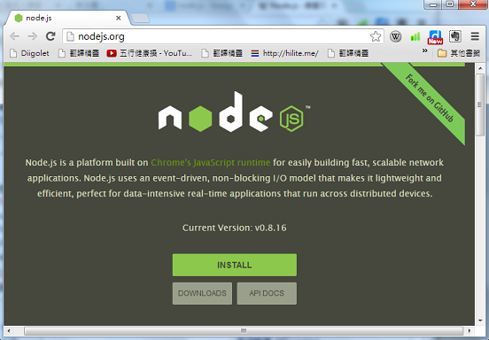

## 軟體短訊-Node.js 

對許多程式人來說一直都是個大障礙，除了沒有好的開發環境之外，無法用 JavaScript 撰寫 Desktop 或 Server 端的程式也是個大問題，還好這些問題現在都有了解法。
Node.js 可以讓你在 Server 端開發JavaScript 程式，就像 Ruby on Rail 或 PHP 一樣，但是卻有著全然不同的設計邏輯與想法。



透過 Node.js , 您可以很容易的測試 JavaScript 程式，並且在 Web 開發的前後端同時使用 node.js，而不需要在前後端分別使用不同語言，這點讓 node.js 特別有吸引力。
以下是一個 node.js 的 「HelloWorld !」 範例程式，您可以看到這種寫法與 PHP 那類將程式嵌入在 HTML 當中的寫法很不相同，反而比較像用 Socket 撰寫網路程式的樣子，但又有些不同。

```JavaScript
var http = require('http');
 
http.createServer(function (request, response) {
    response.writeHead(200, {'Content-Type': 'text/plain'});
    response.end('Hello World\n');
}).listen(8000);

console.log('Server running at http://127.0.0.1:8000/');
```

若您想學習 node.js 程式設計，網路上已經有一群熱心的網友寫出了「node.js 教學手冊」這本中文書，您可以從 <http://book.nodejs.tw/> 這個網址中下載到該電子書。【本文由陳鍾誠取材並修改自維基百科】

