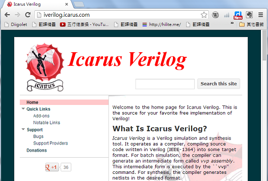

## 硬體短訊-Verilog與icarus

從進入超大型積體電路 VLSI 的時代之後，由於硬體 IC 的線路設計的複雜性已經很難用手工設計，因此 IC 電路的設計通常會採用硬體描述語言 (Hardware Description Language, HDL) 進行設計，而 HDL 的兩大語言 – VHDL 與 Verilog 則成為數位 IC 設計時最常使用的「程式語言」，雖然這種程式語言與一般的程式語言有相當程度的不同點，但是只要適應了這種語言的特性，程式人就能進入硬體設計的領域了。

Icarus 是一組編譯與執行 Verilog 程式的工具軟體，您可以於其官網1上下載此一軟體的 Linux 版，或者從bleyer網站2上下載 Windows 版本，然後可以用 iverilog 這個指令編譯程式，接著用 vvp 這個指令執行 verilog 的測試主程式，以便觀察整個電路模擬結果。

Icarus 的速度很快，比 Altera Quartus II 等工具快很多，原因應該是 Icarus 只模擬但不需要產生可燒入 FPGA 的碼，因此也不太需要進行電路層級的最佳化，筆者很喜歡這個特性，因為這可以讓我省去很多等待編譯的時間。【本文由陳鍾誠撰寫】

