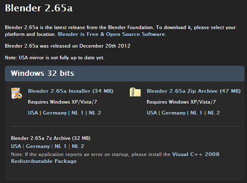
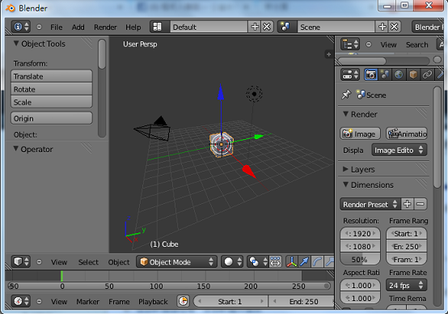

## 動畫短訊-3D動畫軟體 Blender 

很多人都知道 3D-Max 與 Maya 這兩套 3D 動畫軟體，但是知道 Blender 這套 3D 動畫軟體的人就少了許多。但事實上，Blender 這套軟體的能力已經非常強大，並不比  3D-Max 或 Maya遜色了，而且、Blender 是一套您可以合法免費使用的開放原始碼軟體。

您可以從 Blender 的官網3下載此一軟體，2.65a 版 windows 安裝檔目前大小為 34MB 。

Blender 支援 Windows, Linux, MAC OS X, FreeBSD 等環境，而且自從 2.5 版開始，功能就變得很強大，足以與 3D-Max , Maya 競爭了，如果您像筆者一樣，想要瞭解 3D 動畫的領域，從 Blender 開始學習會是一個很不錯的方式。

筆者已經用 Blender 教授動畫四年了，您可以從筆者的網站上取得 Blender 的入門資訊，學習 Blender 最好是觀看教學影片，然後跟著一步一步操作。
下圖是Blender 安裝開啟後的畫面，有興趣的讀者現在就可以立刻下載安裝。

歡迎與筆者一同進入 Blender 的 3D 動畫世界。【本文由陳鍾誠撰寫】

