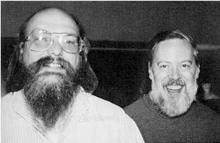

## UNIX與C的創造者–Ken Thompson與Dennis Ritchie

如果說程式領域有偉人的話，那這兩位仁兄肯定會入列 – 湯普遜 (Ken Thompson) & 里奇 (Dennis Ritchie)，他們兩位在 貝爾實驗室帶領一個小組發展出了 UNIX 和 C 語言，影響了千千萬萬的程式人，我們幾乎都活在他們的陰影之下 :)。

最初的Unix是用組合語言編寫的，一些應用是由叫做B語言的解釋型語言和組合語言混合編寫的。B語言在進行系統編程時不夠強大，所以湯普遜和里奇對其進行了改造，並於1971年共同發明了C語言。1973年湯普遜和里奇用C語言重寫了Unix。在當時，為了實作最高效率，系統程式都是由組合語言編寫，所以湯普遜和里奇此舉是極具大膽創新和革命意義的。用C語言編寫的Unix代碼簡潔緊湊、易移植、易讀、易修改，為此後Unix的發展奠定了堅實基礎。

1974年，湯普遜和里奇合作在ACM通訊上發表了一篇關於UNIX的文章，這是UNIX第一次出現在貝爾實驗室以外。此後UNIX被政府機關，研究機構，企業和大學注意到，並逐漸流行開來。

1975年，UNIX發行了4、5、6三個版本。1978年，已經有大約600台電腦在執行UNIX。1979年，版本7發行，這是最後一個廣泛發行的研究型UNIX版本。20世紀80年代相繼發行的8、9、10版本只授權給了少數大學。此後這個方向上的研究導致了九號計畫的出現，這是一個新的分布式作業系統。

1982年，AT&T基於版本7開發了UNIX System Ⅲ的第一個版本，這是一個商業版本僅供出售。為了解決混亂的UNIX版本情況，AT&T綜合了其他大學和公司開發的各種UNIX，開發了UNIX System V Release 1。

這個新的UNIX商業發行版本不再包含原始碼，所以加州大學柏克萊分校繼續開發 BSD UNIX，作為 UNIX System III和V的替代選擇。BSD對UNIX最重要的貢獻之一是TCP/IP。BSD有8個主要的發行版中包含了TCP/IP：4.1c、4.2、4.3、4.3-Tahoe、4.3-Reno、Net2、4.4以及4.4-lite。這些發行版中的TCP/IP代碼幾乎是現在所有系統中TCP/IP實作的前輩，包括AT&T System V UNIX和Microsoft Windows。

作業系統的設計通常是一個很大的工程，幾乎沒有辦法在大學當中傳授實際的設計技巧，以至於所有作業系統的課程幾乎都是以理論為主的方式，這讓作業系統成為程式設計師心中的一個未解之謎。

[UNIXv6](http://en.wikipedia.org/wiki/Version_6_Unix) 是一個相當重要且小型的作業系統，幾乎是所有現代 UNIX 的始祖，雖然 UNIXv6 是在 PDP11 機器上寫的，但在網路上卻有相當完整的資料可以參考，UNIX v6 的作業系統核心大約為 10000 行，因此相當適合想要撰寫作業系統的人學習研究，像是 John Lion 所寫的 [Commentary on the Sixth Edition UNIX Operating System](http://www.lemis.com/grog/Documentation/Lions/) 就是一個很有用的參考文獻。
。

在 MIT 的課程當中，有一門[編號 6.8283 的 Operating System Engineering](http://pdos.csail.mit.edu/6.828/)，其教師 [Frans Kaashoek](http://pdos.csail.mit.edu/~kaashoek/) 將 UNIX v6 的原始碼，修改之後放在 x86 電腦上執行，形成一個只有八千行的 UNIX v6 現代版，稱為 UNIX xv6，Frans Kaashoek 用這個版本作為作業系統課程的起點，這讓我們有機會一睹作業系統的核心原理。【本文由陳鍾誠取材並修改自維基百科】

